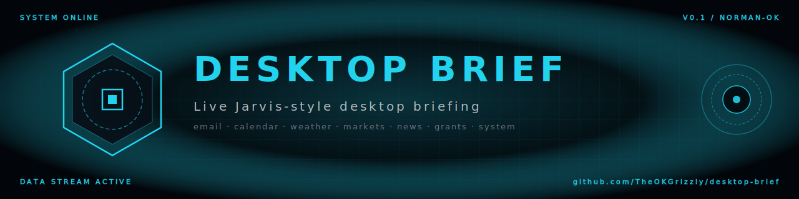
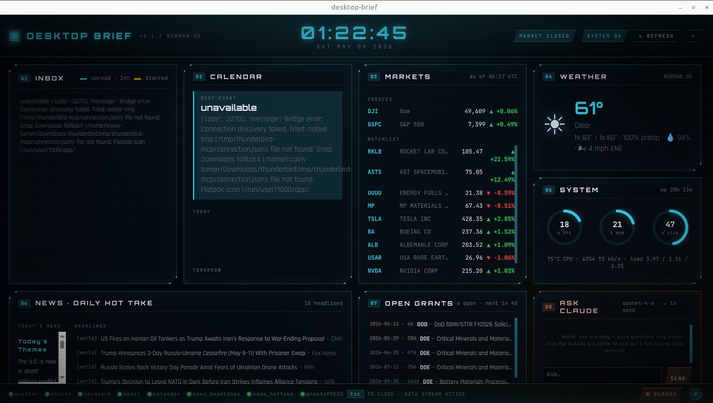

<p align="center">
  
</p>

<p align="center">
  <strong>A live, Jarvis-style desktop briefing for Ubuntu / GNOME-on-Xorg.</strong><br>
  <em>Email · Calendar · Weather · Markets · Hardware · News · Hot-takes · Critical-mineral grants — all on one screen.</em>
</p>

<p align="center">
  <a href="#quick-start"></a>
  
  
  
  
</p>

<p align="center">
  
</p>

---

## What it is

A background daemon polls eight live sources and writes JSON state to
`~/.local/state/desktop-brief/`. Three front-ends consume that state plus a
fourth in-dashboard surface for asking Claude things:

| Surface | What it shows | When you see it |
|---|---|---|
| **Chromium kiosk briefing** | Full-screen Jarvis-themed dashboard with backdrop-filter glass panels, animated arc reactor, scanlines, gauges, and clickable rows | Press `Super+J`, click the dock icon, or auto-launches on login |
| **Ask Claude (#08 panel)** | Embedded chat with Claude in the bottom-right of the briefing — Enter to send, multi-turn history, conversational replies in ~2 s | Inside the briefing window |
| **Eww overlay** *(optional)* | Always-on-top corner widget — clock, weather, ticker, mail counts, system gauges, health dots | `eww open overlay` |
| **Claude Code SessionStart hook** | One-screen markdown briefing injected into every Claude Code session | Automatic on each new Claude Code session |

The data layer is decoupled from presentation, so you can swap or skin any
front-end without touching the backend.

The dashboard footer also has a **CLAUDE pill** — clicking it pops out a full
Claude Code terminal (with file access, Bash, MCP tools) when the embedded
chat isn't enough.

## Architecture

```
┌─ desktop-brief-daemon (systemd --user, asyncio) ─────────────────┐
│                                                                   │
│  Pollers (write JSON state):                                      │
│  ┌─ email_source       Thunderbird MCP (stdio bridge)   60 s ─┐  │
│  ┌─ calendar_source    Thunderbird MCP + 15-min reminders     │  │
│  ┌─ weather            wttr.in JSON                    30 min │  │
│  ┌─ stocks             Stooq CSV (~21 tickers)         60 s   │  │
│  ┌─ hardware           psutil + nvidia-smi              2 s    │  │
│  ┌─ news_headlines     Anthropic API + web_search      15 min │  │
│  ┌─ news_hottake       Anthropic API (analysis)        daily  │  │
│  └─ grants             Anthropic + web_search → DOE/SBIR 6 h  │  │
│                                                                   │
│  Localhost HTTP server (127.0.0.1:8766):                          │
│  ├─ GET  /<source>.json   serve state JSON to the briefing page  │
│  ├─ POST /chat            proxy chat turns to Anthropic API      │
│  └─ POST /launch/claude   spawn `gnome-terminal -- claude`       │
│                                                                   │
│  health.json + LLM-usage caps + atomic JSON state writes          │
└─────────────────────────────┬────────────────────────────────────-┘
                              │
                ┌─────────────┴────────────────┐
                ▼                              ▼
   ┌─ Chromium kiosk briefing ─┐    ┌─ Eww overlay (X11) ──┐
   │ Fullscreen HTML/CSS/JS    │    │ Always-on-top corner │
   │ Glass panels, scanlines,  │    │ widget. defpoll on   │
   │ arc reactor, gauges.      │    │ jq state extracts.   │
   │ Includes #08 ASK CLAUDE   │    │ Light + native.      │
   │ chat panel + pop-out pill │    │ Reads JSON via jq.   │
   │ Bound to Super+J.         │    │                      │
   └───────────────────────────┘    └──────────────────────┘
                              │
                              ▼
              ┌─ Claude Code SessionStart hook ─┐
              │ dbrief-render --hook-json       │
              │ Markdown briefing -> additional │
              │ Context on every session.       │
              └─────────────────────────────────┘
```

## Features

### Live data sources

- **📧 Email** — across all Thunderbird accounts. Dedupes copies-across-folders
  by `(author, subject, date)` fingerprint so the same message in your Inbox
  + Local Folders archive only appears once. Filters: unread last 24 h + starred.
- **📅 Calendar** — today + tomorrow events from Thunderbird's calendar.
  Fires `notify-send` reminders 15 minutes before each event with persistent
  dedup state so a daemon restart doesn't re-fire morning alarms.
- **🌡 Weather** — wttr.in (Norman, OK by default; override with `WEATHER_QUERY`).
- **📈 Markets** — ~21 tickers via Stooq's free CSV API (no auth, no rate-limit
  pain). Indexes (Dow / Nasdaq / S&P), tech megacaps, robotics, space,
  rare-earth & critical minerals. Market-hours-aware cadence: 60 s during
  regular session, 15 min off-hours.
- **🖥 Hardware** — CPU, RAM, disk, network throughput, temperatures via
  `psutil`. NVIDIA GPU utilisation/memory/temp via `nvidia-smi`.
- **📰 News + daily Hot Take** — top headlines every 15 min via the Anthropic
  API + the `web_search` server tool. Hot-take editorial summary regenerates
  once a day (LLM-cost-controlled).
- **💰 Grants** — DOE / SBIR / ARPA-E open funding opportunities for critical
  minerals, REE, advanced materials, and geothermal lithium. Sorted by
  deadline. Refreshed every 6 h.

### Interactive surfaces in the briefing

- **💬 Ask Claude (#08 panel)** — embedded multi-turn chat with Claude
  Sonnet 4.6, bottom-right of the dashboard. Enter to send, Shift+Enter for
  newlines, history capped at 12 messages. Conversational replies in ~2 s.
  No file access / Bash / MCP — for that, click the CLAUDE pill in the footer.
- **🚀 CLAUDE pill** — bottom-right of the footer. One click pops out a real
  Claude Code session in `gnome-terminal` (or kitty / ghostty / alacritty /
  xterm — first found wins). Full file access, Bash, MCP, and the works.

### Reliability + cost guardrails

- **Atomic state writes** — `tmpfile + os.replace` so readers never see a
  half-written JSON file.
- **Per-source health tracking** — `health.json` records `last_success`,
  `last_error`, `consecutive_failures`. Both front-ends render coloured dots
  (green / amber / red) so you can see at a glance which sources are healthy.
- **Backoff on failure** — exponential up to 5 minutes per source.
- **LLM call caps** — daily limits per source (`LLM_DAILY_CALL_CAP_NEWS=120`,
  etc.) with usage tracked in `llm_usage.json`. Prompt caching on system
  prompts to control spend.
- **Graceful degradation** — Thunderbird offline? Email + calendar mark
  themselves unavailable instead of crashing. Yahoo blocked your IP? We never
  used Yahoo — Stooq is the primary source for exactly this reason.

### `dbrief-doctor` health check

```bash
dbrief-doctor   # (or `make doctor`)
```

Verifies session type (X11 required for Eww), all required binaries
(`python3`, `node`, `jq`, `notify-send`, …), `.env` config, systemd unit
status, MCP bridge reachability, and per-source freshness — emits coloured
✓ / ! / ✗ for each.

## Quick start

### Requirements

- Ubuntu 24+ on an **X11 session** (Eww does not work on GNOME Wayland —
  Mutter doesn't implement `wlr-layer-shell`)
- Python ≥ 3.11
- Node ≥ 18 (for the Thunderbird MCP bridge)
- Cargo (the installer builds Eww from upstream git)
- Thunderbird with the [thunderbird-mcp](https://github.com/TKasperczyk/thunderbird-mcp) extension installed
- An [Anthropic API key](https://console.anthropic.com/settings/keys) — **required** for the news headlines, daily hot-take, grants polling, **and the embedded #08 Ask Claude chat panel**. Without it the daemon still runs (weather, stocks, hardware, email, calendar all work) but the LLM-backed sources and the chat panel are disabled.

### Install

```bash
git clone https://github.com/TheOKGrizzly/desktop-brief.git
cd desktop-brief
./install.sh
```

The installer is idempotent. It:
1. Installs apt deps (`jq`, `libnotify-bin`, GTK/Eww build deps, …)
2. Installs `rustup` if cargo is missing
3. Builds Eww from `github.com/elkowar/eww` (X11-only build, ~5 min the first time)
4. Creates the Python venv and installs the package editable
5. Seeds `.env` from `.env.example` (chmod 600)
6. Symlinks `eww/` into `~/.config/eww/desktop-brief`
7. Installs and enables the `desktop-brief.service` systemd `--user` unit
8. Binds `Super+J` to open the Chromium briefing via GNOME custom shortcut

### Manual follow-ups (the installer prints these)

1. **Add your Anthropic API key** to `.env`
2. **Install the Thunderbird MCP `.xpi`** via Thunderbird's add-on manager
   (one-time GUI step the installer can't do for you)
3. **Wire the Claude Code hook + MCP server** — copy-pasteable JSON in
   [`docs/CLAUDE_HOOK_SETUP.md`](docs/CLAUDE_HOOK_SETUP.md)

### Daily commands

| | |
|---|---|
| `make logs` | Tail the daemon journal |
| `make status` | Systemd unit status |
| `make restart` | Restart the daemon |
| `make doctor` | Run `dbrief-doctor` health check |
| `make test` | Run the unit tests |
| `dbrief-render --markdown` | Print the briefing to stdout |
| `~/.cargo/bin/eww --config ~/.config/eww/desktop-brief open overlay` | Open the corner overlay |

## Configuration

Most knobs live in `src/desktop_brief/config.py` (ticker list, source
intervals) and are loaded from `.env` at startup.

### Environment variables (`.env`)

| Name | Default | Purpose |
|---|---|---|
| `ANTHROPIC_API_KEY` | _required_ for LLM-backed features | News headlines · daily hot-take · grants polling · **embedded chat panel** |
| `CLAUDE_MODEL` | `claude-sonnet-4-6` | Override the model used for news / hot-take / grants / chat |
| `THUNDERBIRD_MCP_BRIDGE` | `~/projects/thunderbird-mcp/mcp-bridge.cjs` | Path to the bridge if you cloned it elsewhere |
| `WEATHER_QUERY` | `Norman,OK` | wttr.in location string |
| `TZ_LOCAL` | `America/Chicago` | Display timezone |
| `TZ_MARKET` | `America/New_York` | Market-hours timezone |
| `LLM_DAILY_CALL_CAP_NEWS` | `120` | Max headline calls per day (96 covers 15-min cadence) |
| `LLM_DAILY_CALL_CAP_HOTTAKE` | `3` | Max hot-take regenerations per day |
| `LLM_DAILY_CALL_CAP_GRANTS` | `8` | Max grant polls per day |

### Watchlist

Edit `INDEX_SYMBOLS` and `WATCHLIST_SYMBOLS` in `src/desktop_brief/config.py`.
Symbols are Yahoo-style (`TSLA`, `^DJI`); Stooq mapping happens automatically.

## Repo layout

```
desktop-brief/
├─ assets/             logo, banner, screenshot, social preview
├─ briefing/           Chromium kiosk dashboard (HTML/CSS/JS)
├─ docs/               CLAUDE_HOOK_SETUP, architecture notes
├─ eww/                yuck overlay config + scss + jq scripts
├─ gnome/              apply-shortcut.sh (Super+J binding)
├─ hooks/              session_start.sh — Claude Code SessionStart wrapper
├─ src/desktop_brief/
│  ├─ cli/             daemon_main, render_main, doctor entrypoints
│  ├─ llm/             Anthropic client + cached system prompts
│  ├─ mcp/             Thunderbird MCP stdio client (no anthropic-sdk dep)
│  ├─ render/          state JSON → markdown briefing
│  └─ sources/         email, calendar, weather, stocks, hardware, news, grants
├─ systemd/            user systemd unit
├─ tests/              pytest suite (state, stocks market hours, render)
├─ install.sh / uninstall.sh
└─ Makefile
```

## State files (the JSON contract)

All files live in `~/.local/state/desktop-brief/` with envelope:

```json
{
  "schema_version": 1,
  "generated_at": "2026-05-09T00:42:08+00:00",
  "source": "weather",
  "data": { ... }
}
```

Per-source schemas are documented in
[`docs/CLAUDE_HOOK_SETUP.md`](docs/CLAUDE_HOOK_SETUP.md) and inferable from
the Python source files in `src/desktop_brief/sources/`.

## Why these tech choices

- **Eww + Chromium hybrid** — Eww (GTK) is great for cheap, native, always-on
  widgets but its CSS subset can't reproduce the holographic effects
  (`backdrop-filter`, `clip-path`, `mix-blend-mode`) that make a Jarvis
  dashboard look like one. Chromium kiosk gives full CSS for the marquee
  briefing window without giving up Eww's lightweight overlay.
- **Stooq, not Yahoo** — Yahoo Finance aggressively 429s home and server IPs
  and requires a brittle crumb/cookie dance. Stooq is free, no auth, and
  more lenient. We pay a small cost (per-symbol fetch instead of batch) for
  much better reliability.
- **stdio JSON-RPC client, not the MCP SDK** — the MCP SDK is overkill when
  the daemon only needs to call four tools. A 200-line stdio client with
  request/response correlation is simpler, has fewer moving parts, and
  makes the Anthropic-SDK direct LLM client coherent with no second runtime.
- **Local HTTP server for the briefing** — Chromium blocks `file://` fetches
  for security. A localhost-only `http.server` thread on `127.0.0.1:8766`
  serves the state directory; no `--allow-file-access-from-files` flags or
  fragile URL hacks. The same server hosts the `POST /chat` endpoint (chat
  panel proxies to the Anthropic API) and `POST /launch/claude` (allowlisted
  spawn of `gnome-terminal -- claude` for the pop-out terminal). No shell
  interpolation; argv is fixed at module load.

## Tested environment

Built and verified on:

| | |
|---|---|
| **Hardware** | Dell G7 7700 — Intel i7-10750H (12 logical cores), 31.1 GB RAM, NVIDIA GeForce RTX 2070 |
| **OS** | Ubuntu 24.04.4 LTS (Noble Numbat), kernel 6.17.0-23-generic |
| **Desktop** | GNOME Shell 46.0 on Xorg (X11) |
| **Toolchain** | Python 3.12.3 · Node v18.19.1 · Eww 0.6.0 (built from upstream `master`) |
| **Thunderbird** | Snap (channel current), with `thunderbird-mcp` extension |

It should work on any Ubuntu 22.04+ box with an X11 session, GNOME or another
EWMH-compliant WM, and a recent Python. **It will not work on GNOME Wayland**
because Mutter doesn't implement `wlr-layer-shell` — Eww silently fails to
anchor. If you're on Wayland, log out and pick the **Ubuntu on Xorg** session
at the login screen.

GPU panel auto-hides if `nvidia-smi` is absent (AMD/Intel GPU users: PRs
welcome to add `radeontop` / `intel_gpu_top` parsing).

## Acknowledgements

- [TKasperczyk/thunderbird-mcp](https://github.com/TKasperczyk/thunderbird-mcp) — the Thunderbird MCP extension and bridge
- [elkowar/eww](https://github.com/elkowar/eww) — the always-on-top widget toolkit
- [wttr.in](https://wttr.in/) — free weather JSON
- [stooq.com](https://stooq.com/) — free market data CSV
- The [Anthropic Claude API](https://www.anthropic.com/) for news synthesis and grant scouting
- Visual debt to Jayse Hansen's MCU FUI work and the entire `r/unixporn`
  cyberpunk dashboard tradition

## License

MIT. See [LICENSE](LICENSE).

---

<p align="center">
  <em>Built in one evening with Claude Opus 4.7. PRs and forks welcome.</em>
</p>
